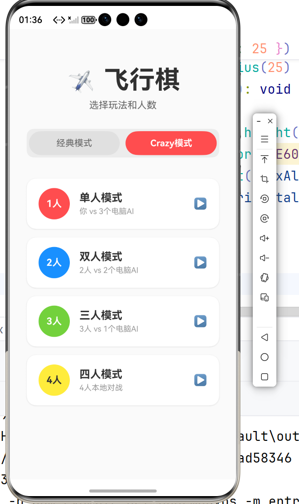
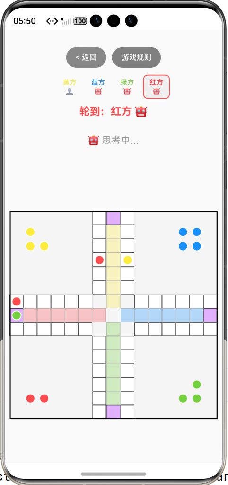
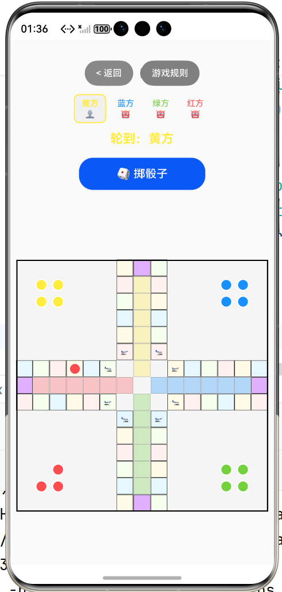
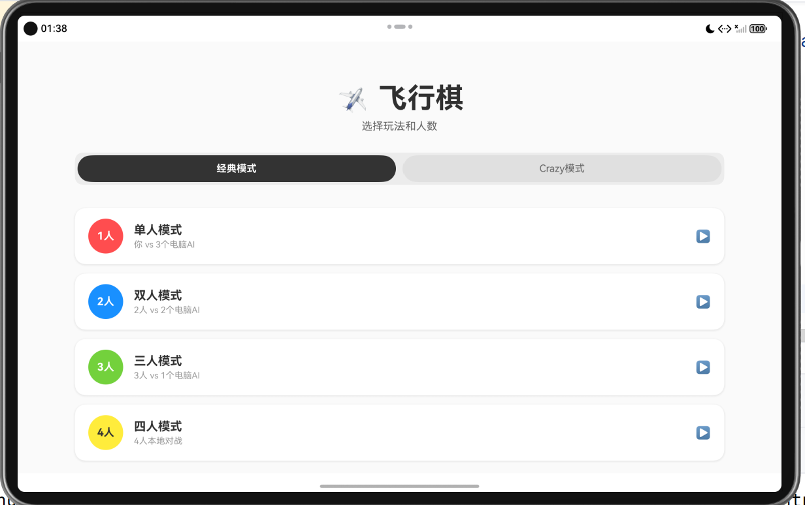
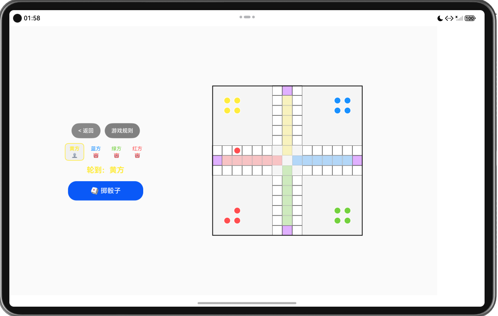
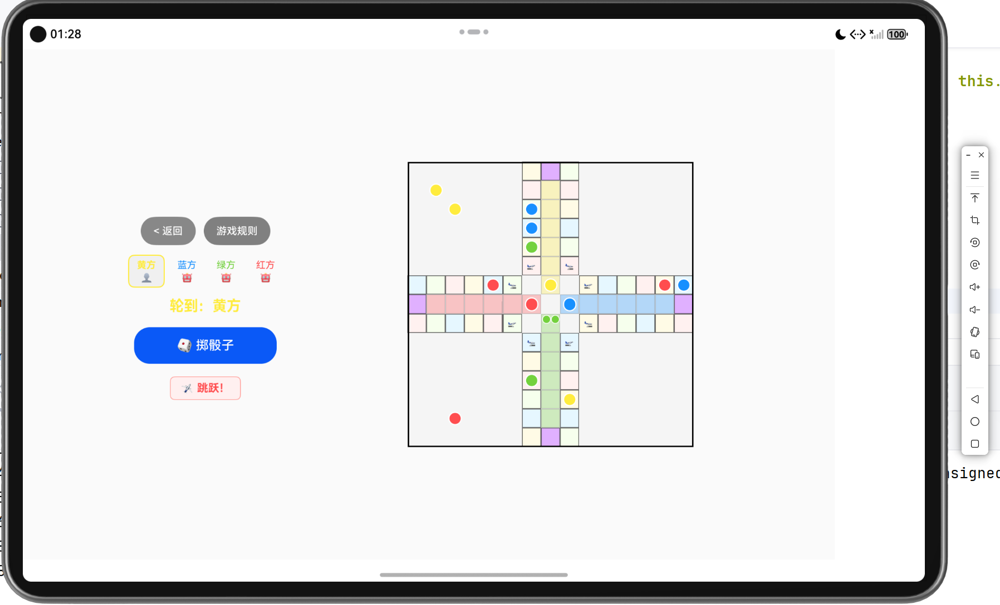

# ✈️ 基于 ArkUI 的全功能自适应疯狂飞行棋游戏 (CrazyFlyingChess)

[](https://developer.huawei.com/)
[](https://developer.huawei.com/)
[](LICENSE)

`CrazyFlyingChess` 是一款基于 **HarmonyOS ArkUI 声明式框架** 开发的多端自适应、中轻度单机 / 多人同屏对抗飞行棋游戏。项目深度融入了经典飞行棋玩法控制流，并创新实现了 **Crazy 连锁特效模式** 与 **智能启发式 AI 评估决策链**。

---

## 🌟 核心功能特性

### 1. 基础核心玩法（经典模式）
* **起飞与连投机制**：精准模拟掷出 6 点起飞，以及连续掷出 6 点时的额外连投奖励。
* **动态碰撞（吃子）**：非安全格内多方棋子落点重合时自动触发碰撞判定，被吃棋子即时重置回对应阵营的大本营。
* **绝对终点判定**：终点精准落位判定。若剩余步数不足以精准到达终点（57号格），超出步数将自动向回复归（反弹回退），完全符合经典飞行棋标准规则。

### 2. 多人对战与混合轮转 ✨
* **自由人数配置**：支持本地 1 ~ 4 名人类玩家自由选择参战人数，灵活开启棋局。
* **人类-AI 混战代理**：未被选定的空缺阵营由系统自动接管为 AI 智能代理，实现纯单机人机对战与本地同屏多人对抗的无缝兼容。
* **轮转状态机**：每轮结束后系统自动推进至下一存活阵营，AI 回合自动触发决策，人类回合亮出掷骰子按钮等待操作，两者切换无感。

### 3. 疯狂特效玩法（Crazy 模式）✨
`Crazy 模式`在经典规则之上叠加了三层级联特效，改变了每一步落点的战略价值：

| 特效类型 | 触发条件 | 效果说明 |
| :--- | :--- | :--- |
| **🎨 同色 4 格跳跃** | 棋子落入与自身阵营颜色相同的普通格 | 立刻向前跃进 4 格 |
| **🛫 跨海大飞行** | 精准落入本阵营专属飞行起点格（🛫） | 跨海跃迁，直飞 12 格至对岸落点格（🛬） |
| **🔗 多级连锁套娃** | 跳跃或大飞行后再次满足后续触发条件 | 支持 `普通移动 ➔ 同色跳跃 ➔ 飞行起点 ➔ 二次跨海大飞行` 全链路级联判定 |

> ⚠️ **规则细节**：通往终点的内圈专属赛道格不触发同色跳跃，避免棋子在终点前陷入无限循环。

---

## 📱 一多开发（一次开发，多端部署）

项目引入 `@ohos.mediaquery` 模块，通过**屏幕方向**与**物理宽度**的双重监听器，精准感知设备形态并自动流转布局：


```

设备形态检测
├── 竖屏 / 手机形态 ───> Flex Column 布局：控制面板悬浮棋盘下方，纵向空间最大化
└── 横屏 / 平板 / 折叠屏 ➔ Flex Row 布局：控制面板分栏至棋盘左侧，横向黄金空间完全释放给棋盘画布

```

### 核心监听代码示意

```typescript
import mediaquery from '@ohos.mediaquery';

// 监听屏幕横竖屏状态
private portraitListener = mediaquery.matchMediaSync('(orientation: portrait)');

onEntries() {
  this.portraitListener.on('change', (result) => {
    this.isPortrait = result.matches;
  });
}

```

---
## 📸 效果预览

项目深度践行鸿蒙生态的“一次开发，多端部署”核心理念。引入 `@ohos.mediaquery` 模块，通过屏幕方向与物理宽度的双重监听器，精准感知设备形态并自动流转布局：

* **手机端（竖屏形态）**：自适应为 `FlexDirection.Column` 布局，控制面板悬浮于棋盘下方，最大化纵向操作空间。
* **平板端（横屏形态）**：自适应为 `FlexDirection.Row` 布局，控制面板分栏至棋盘左侧，横向黄金空间完全释放给棋盘画布。

### 📱 手机端全功能体验
| 🎮 1. 主菜单配置 | 🎲 2. 普通模式对局 | ⚡ 3. Crazy 模式（连跳特效） |
| :---: | :---: | :---: |
|  |  |  |
| 支持 1~4 人自由参战人数配置，空缺阵营由 AI 智能接管 | 经典十字风车棋盘，支持多棋子同格缩放防重叠交互 | 踩中同色格/飞行起点触发跳跃与跨海大飞行连锁特效 |

### 💻 平板端 / 折叠屏横屏体验
| 🎮 4. 主菜单配置 | 🎲 5. 普通模式对局 | ⚡ 6. Crazy 模式（连跳特效） |
| :---: | :---: | :---: |
|  |  |  |
| 完美适配大屏横向比例，玩法模式配置一目了然 | 画面自适应横向分栏，左侧控制面板与右侧棋盘协同 | 级联特效文本、追尾风险提示动态感知，大屏体验更佳 |

> 💡 **运行提示**：项目已在 HarmonyOS 模拟器（Phone / Tablet）及真机上通过完整双端调测，均可直接编译部署运行。
---

## 🤖 动态启发式 AI 评估链

为 AI 设计了基于 **"多维收益-风险模型"** 的评估函数 `evaluateMove(planeIdx: number): number`。在 AI 回合时，决策引擎对当前阵营所有可移动棋子逐一打分，并选取最高分棋子执行：

| 评估维度 | 分值权重 | 决策逻辑说明 |
| --- | --- | --- |
| **🎯 吃子 / 斩杀奖励** | `+80 ~ +150` | 虚拟落点若存在敌方棋子，赋予极高权重优先执行截击。 |
| **📈 路径成长收益** | 正相关权重 | 鼓励棋子持续向前推进，步数越靠前基础分值越高。 |
| **🏁 冲刺完赛增益** | `+200 ~ +600` | 棋子进入终点格或拐入内圈安全道时优先级最高。 |
| **🛡️ 动态追尾风险惩罚** | `-20 ~ -80` | 虚拟落点后方 1~6 格内若存在敌机威胁则进行扣分惩罚。 |

> 💡 辅助函数 `isDangerousPosition()` 负责实时计算后方威胁概率，使 AI 具备基础的 **"防守避险"** 智能，而非单纯盲目冒进。

---

## 📂 项目工程结构

```text
CrazyFlyingChess/
├── entry/
│   └── src/
│       └── main/
│           ├── ets/
│           │   ├── pages/
│           │   │   └── Index.ets           # 主工程入口：核心状态机、多人/AI 轮转控制流
│           │   └── view/
│           │       ├── RulesDialog.ets     # 自定义游戏规则弹出层（@CustomDialog）
│           │       └── ModeSelectPage.ets  # 玩法模式（经典/Crazy）与参战人数配置入口
│           └── resources/                  # 媒体资源、图标与国际化文本配置
├── build-profile.json5                     # 鸿蒙构建配置文件
└── README.md                               # 项目说明文档

```

---

## 🚀 快速开始

### 环境要求

* **DevEco Studio**: `4.0` 或更高版本
* **HarmonyOS SDK**: `API 9` 及以上
* **运行设备**: 已配置的 HarmonyOS 模拟器（Phone/Tablet）或已解锁调测权限的真机

### 运行步骤

1. **克隆仓库**
```bash
git clone [https://github.com/](https://github.com/)<your-username>/CrazyFlyingChess.git

```


2. **导入项目** 使用 DevEco Studio 打开项目根目录 `CrazyFlyingChess`。
3. **同步工程** 等待系统自动触发 `hvigor` 同步完成（首次构建可能需要联海外网下载部分依赖组件）。
4. **编译运行** 选择对应的模拟器或连接真机设备，点击顶部工具栏的 **Run (▶)** 按钮运行。

> 🛠️ **常见问题排除**：若在 Git 切换分支或更新环境后遇到模块识别失败，可尝试在顶部菜单执行 `Build -> Clean Project`，或手动删除项目根目录下的 `.idea/` 与 `.hvigor/` 目录后重新打开项目，触发缓存完整重建。

---

## 🕹️ 游戏玩法说明

1. **进入游戏**：在主菜单选择「经典模式」或「Crazy 模式」，再勾选参与的人类玩家人数（1 ~ 4 人）。
2. **人类回合**：轮到人类操作时，「掷骰子」按钮高亮。点击掷骰后，系统会自动判定可移动棋子，点击对应棋子即可向前飞行。
3. **AI 回合**：无需人工干预，系统全自动完成动态智能决策、碰撞拦截和连锁动画演绎。
4. **连投规则**：掷出 6 点时可额外获得一次连续掷骰机会。
5. **胜利条件**：率先将所属阵营全部 4 枚棋子送入 57 号绝对终点的阵营获得本局胜利。
6. **查看规则**：游戏对局内右上角的「游戏规则」防呆按钮可随时查看级联跳跃等高阶判定。

---

## 🛠️ 技术栈

| 技术 / 组件 | 核心用途说明 |
| --- | --- |
| **HarmonyOS ArkUI（ArkTS）** | 声明式 UI 框架，负责游戏核心状态机维护与大本营/棋道动态刷新。 |
| **@ohos.mediaquery** | 响应式多端自适应布局监听，实现多端画布空间最大化。 |
| **@CustomDialog** | 独立轻量化游戏规则与连跳级联特效文字动态弹出层。 |
| **@Observed / @ObjectLink** | 棋子深层坐标与状态的响应式数据绑定，拒绝 DOM 低效全量刷新。 |
| **Heuristic AI Engine** | 基于纯 ArkTS 链式实现的启发式评估 AI 代理引擎。 |

---

## 📄 开源协议

本项目基于 **[MIT License](LICENSE)** 协议开源。欢迎随时 Fork、提交 Star 或通过 Issue 提交您的敏捷重构意见！

```

```
